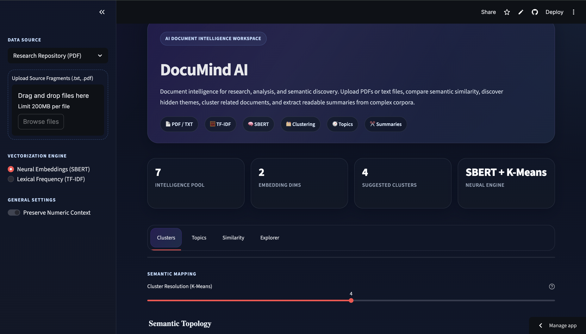

# DocuMind AI

> Transform unstructured documents into structured insights using semantic analysis, clustering, and summarization.

**Built to bridge the gap between NLP models and real-world usable systems.**

---

## Preview



---

## Live Demo

https://docu-mind-ai-kaavya.streamlit.app/

---

## Overview

DocuMind AI is an interactive document intelligence system that enables users to explore, compare, and understand document collections efficiently.

Instead of treating NLP as isolated experiments, this project integrates multiple techniques into a single usable system.

---

## What It Does

- Analyze **PDF and TXT documents**
- Compare documents using **semantic similarity (SBERT)** or **lexical similarity (TF-IDF)**
- Automatically group documents using **K-Means clustering**
- Discover themes using **LDA topic modeling**
- Generate **extractive summaries**
- Visualize insights through an interactive interface

---

## Example Output

**Input**
- 5 research papers on machine learning

**Output**
- 3 semantic clusters
- Topic keywords per cluster
- Similarity heatmap
- Summaries for each document

---

## Core Capabilities

### Document Processing
- Multi-file ingestion (PDF + TXT)
- Text preprocessing pipeline

### Representation
- TF-IDF for interpretable keyword analysis
- SBERT for semantic understanding

### Analysis
- K-Means clustering
- Cosine similarity matrix
- LDA topic modeling
- Extractive summarization

### Interface
- Interactive Streamlit dashboard
- Structured navigation across analysis layers

---

## Architecture

```
User Interface (Streamlit)
        │
        ▼
Document Ingestion (PDF / TXT)
        │
        ▼
Preprocessing (cleaning, normalization)
        │
        ├───────────────┐
        ▼               ▼
TF-IDF Pipeline     SBERT Embeddings
        │               │
        └───────┬───────┘
                ▼
        Analysis Layer
   (Clustering, Similarity,
    Topic Modeling, Summary)
                │
                ▼
        Visualization Layer
```

---

## TF-IDF vs SBERT

| Aspect | TF-IDF | SBERT |
|------|--------|------|
| Type | Lexical | Semantic |
| Strength | Interpretability | Context understanding |
| Speed | Fast | Slower |
| Use Case | Keywords, LDA | Similarity, clustering |

---

## Tech Stack

**Core**
- Python
- Streamlit

**NLP / ML**
- scikit-learn
- Sentence Transformers (SBERT)
- TF-IDF Vectorization
- K-Means Clustering
- LDA Topic Modeling

**Visualization**
- Plotly
- Pandas

---

## Use Cases

- Research paper clustering  
- Literature review acceleration  
- Technical document comparison  
- Theme discovery  
- Knowledge base exploration  

---

## Project Structure

```
DocuMind-AI/
├── app.py
├── preprocessing.py
├── modeling.py
├── utils.py
├── requirements.txt
├── research_documents/
└── .github/workflows/
```

---

## Local Setup

```bash
git clone https://github.com/KaavyaGala546/DocuMind-AI.git
cd DocuMind-AI
python -m venv venv
venv\Scripts\activate   # Windows
source venv/bin/activate # Mac/Linux
pip install -r requirements.txt
streamlit run app.py
```

---

## Design Philosophy

This project focuses on:

- Turning NLP pipelines into **usable systems**
- Balancing **interpretability and semantic depth**
- Building tools that are both **technical and practical**

---

## Limitations

- Summarization is extractive
- Performance depends on dataset quality
- LDA less effective on small datasets

---

## Roadmap

- Persistent document sessions  
- Exportable reports  
- Advanced summarization  
- Retrieval-based querying  
- Migration to full-stack architecture  

---

## Author

**Kaavya Gala**  
AI / Full Stack Developer  

GitHub: https://github.com/KaavyaGala546  

---

## Final Note

This project is not just about NLP models — it is about building systems that make those models usable.
